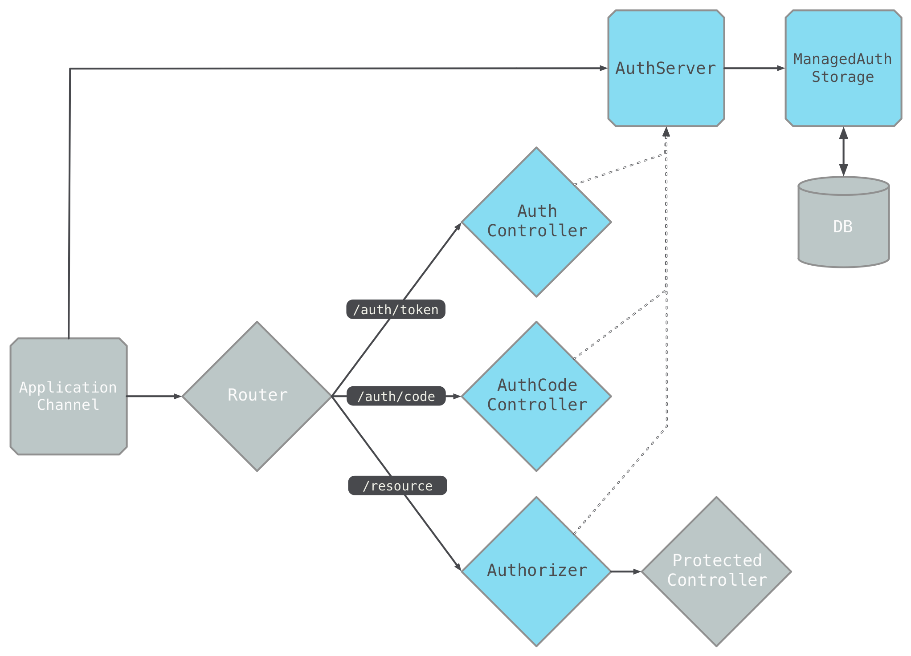

## Tasks

Conduit has types to manage authentication and authorization according to the [OAuth 2.0 specification](https://tools.ietf.org/html/rfc6749).

You create an `AuthServer` service object for your application that manages authentication and authorization logic. An `AuthServer` requires a helper object that implements `AuthServerDelegate` to handle configuration and required data storage. Most often, this object is a `ManagedAuthDelegate<T>` that uses the Conduit ORM to manage this storage.

An `AuthServer` service object is injected into `Authorizer` controllers that protect access to controller channels. An `AuthServer` is also injected into `AuthCodeController` and `AuthController` to provide HTTP APIs for authentication.

The `conduit auth` command-line tool manages configuration - such as client identifier management - for live applications.

## Guides

- [What is OAuth 2.0?](what_is_oauth.md)
- [Creating and Using AuthServers](server.md)
- [Securing Routes with Authorizer](authorizer.md)
- [Adding Authentication Endpoints](controllers.md)
- [Using Scopes to Control Access](auth_scopes.md)
- [Managing OAuth 2.0 Clients](cli.md)
